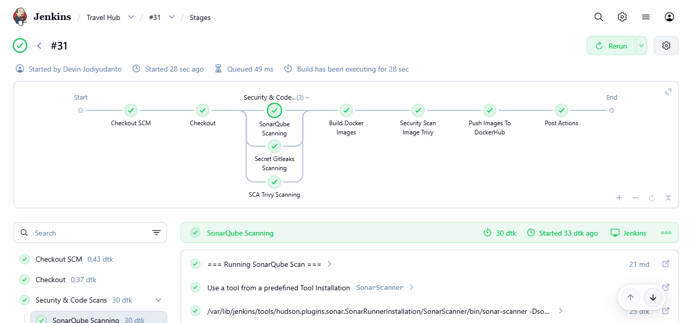
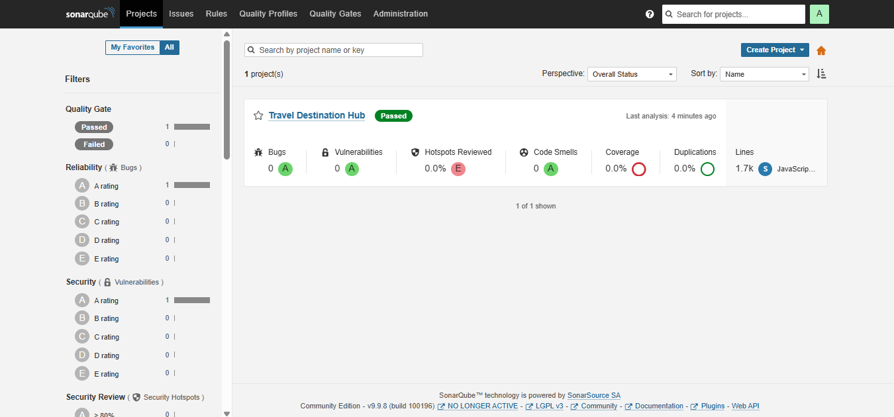
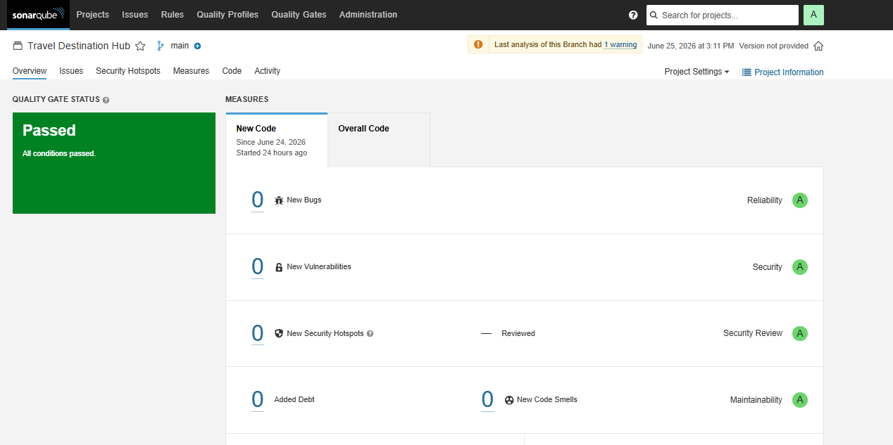
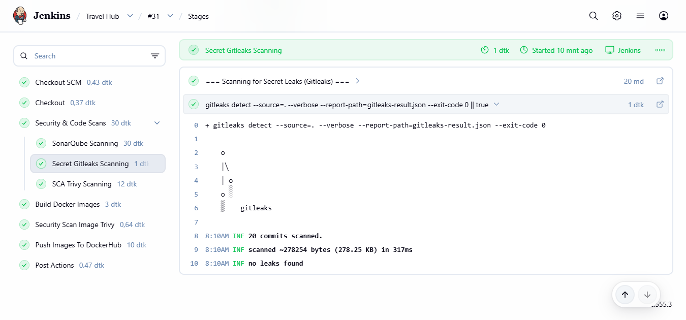
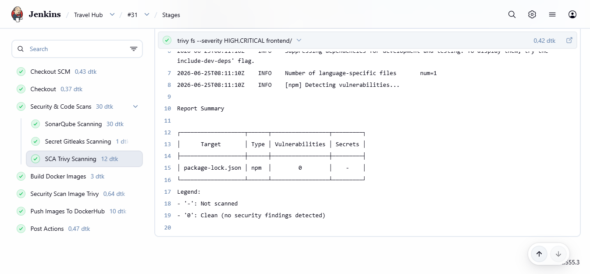
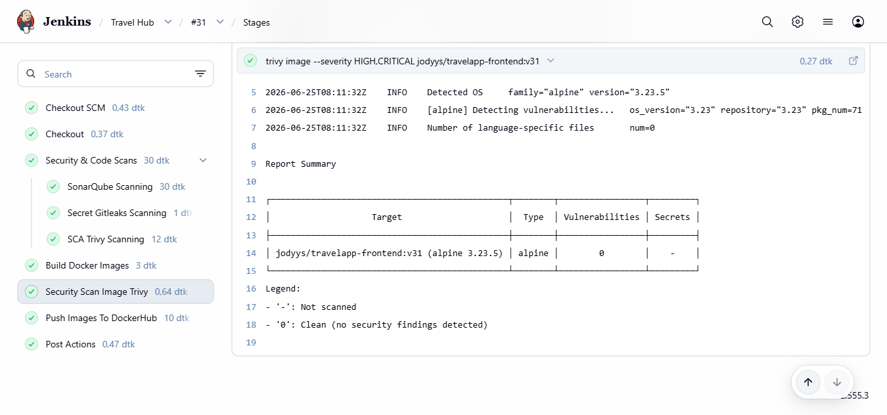
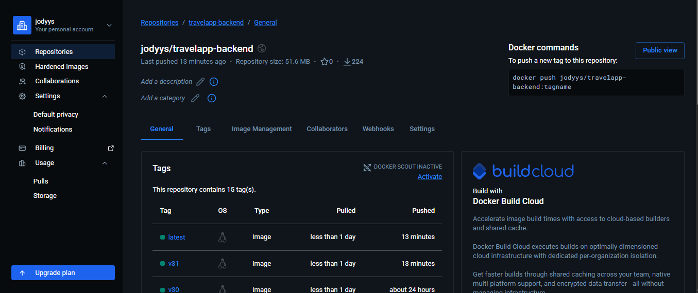
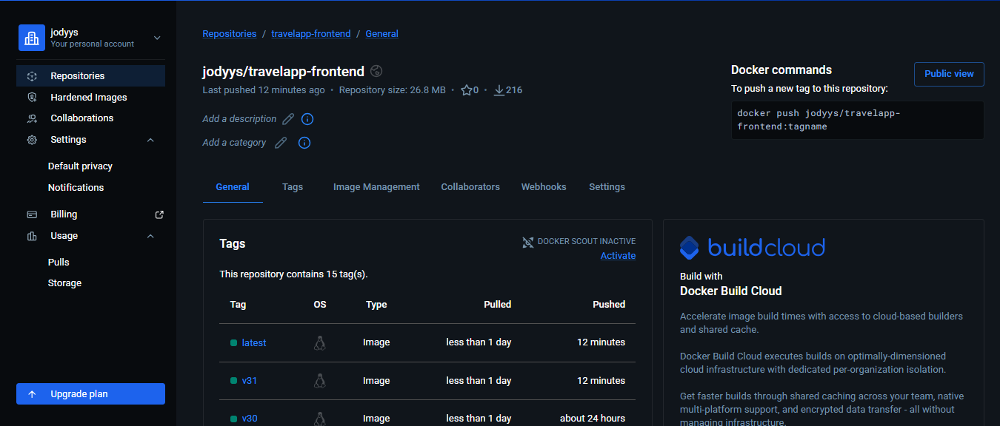

# Jenkins CI Pipeline

## Overview

This project demonstrates a DevSecOps Continuous Integration (CI) pipeline using Jenkins. The pipeline automates source code checkout, code quality analysis, secret detection, vulnerability scanning, Docker image creation, and publishing images to Docker Hub.

---

## Tech Stack

- Jenkins
- GitHub
- Docker
- Docker Hub
- SonarQube
- Gitleaks
- Trivy

---

## Pipeline Stages

| Stage | Description |
|--------|-------------|
| Checkout SCM | Retrieve source code from GitHub |
| Checkout | Prepare workspace |
| SonarQube Scan | Perform static code analysis |
| SonarQube Quality Gate | Validate code quality |
| Secret Scanning | Detect exposed secrets using Gitleaks |
| SCA Scan | Scan project dependencies and filesystem using Trivy |
| Build Docker Images | Build Docker image |
| Security Scan Image | Scan Docker image using Trivy |
| Push Images to DockerHub | Push Docker image to Docker Hub |
| Post Actions | Cleanup workspace and archive artifacts |

---

## Pipeline Workflow

```text
GitHub
   │
   ▼
Checkout SCM
   │
   ▼
Checkout
   │
   ▼
SonarQube Scan
   │
   ▼
Quality Gate
   │
   ▼
Gitleaks Secret Scan
   │
   ▼
Trivy Filesystem Scan
   │
   ▼
Build Docker Image
   │
   ▼
Trivy Image Scan
   │
   ▼
Push Image to Docker Hub
   │
   ▼
Post Actions
```

---

## Security Checks

- Static Application Security Testing (SAST) using SonarQube
- Secret Detection using Gitleaks
- Software Composition Analysis (SCA) using Trivy Filesystem Scan
- Container Image Vulnerability Scan using Trivy

---

## Project Structure

```text
.
├── Jenkinsfile
├── Dockerfile
├── README.md
└── src/
```

---

## Screenshots

### Jenkins Pipeline



---

### SonarQube Dashboard



---

### SonarQube Quality Gate



---

### Gitleaks Secret Scan



---

### Trivy Filesystem Scan



---

### Trivy Image Scan



---

### Docker Hub Repository

Backend


Frontend


---

## Future Improvements

- Continuous Deployment to K3s
- GitOps with ArgoCD
- OWASP ZAP DAST Integration

## Author

**Devin Jodiyudanto**
