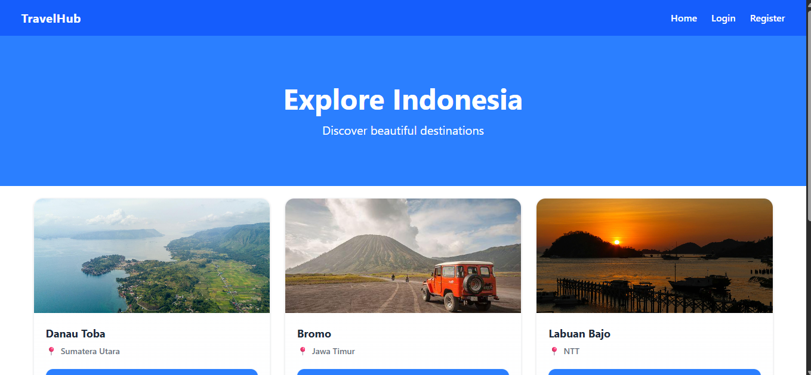
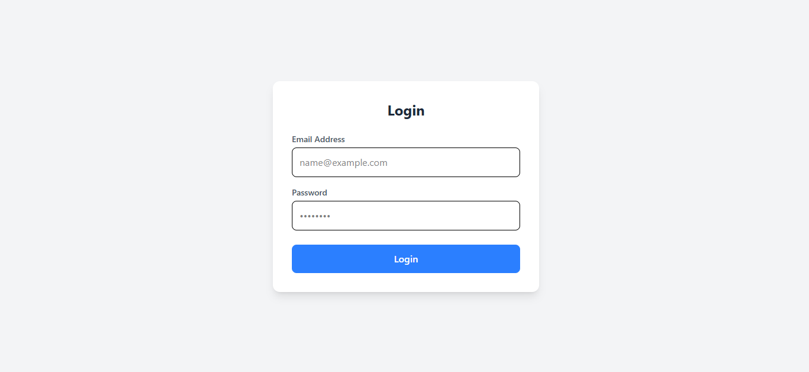
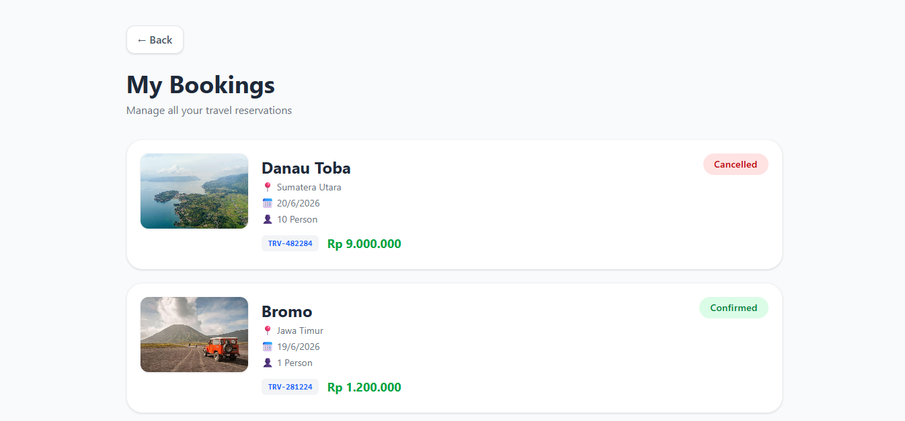

# Travel Destination Hub

## Features
- User Authentication
- Destination Management
- Admin Dashboard
- PostgreSQL Database

## Tech Stack
- React
- Node.js
- Express
- PostgreSQL
- Docker Compose

Next
- Kubernetes (K3s)
- Jenkins
- ArgoCD

## Run Locally

### Backend
npm install
npm run dev

### Frontend
npm install
npm start

### Docker
docker compose up -d

## Screenshots
Dashboard

Login Page

Mybooking

